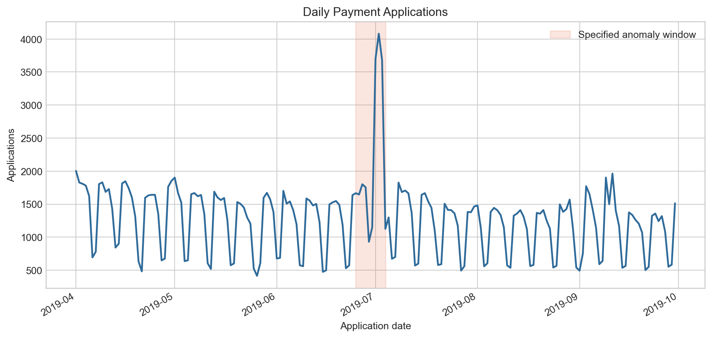
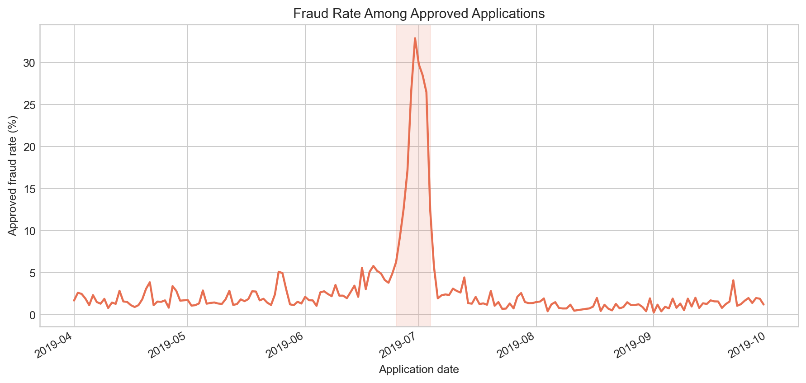
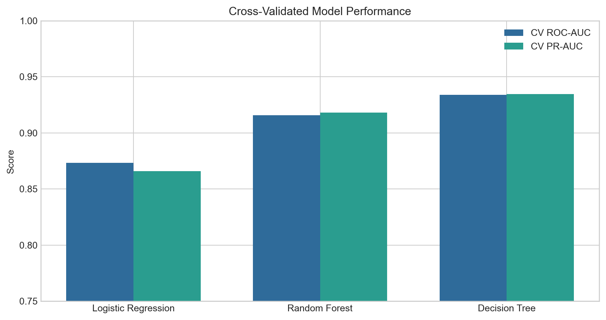
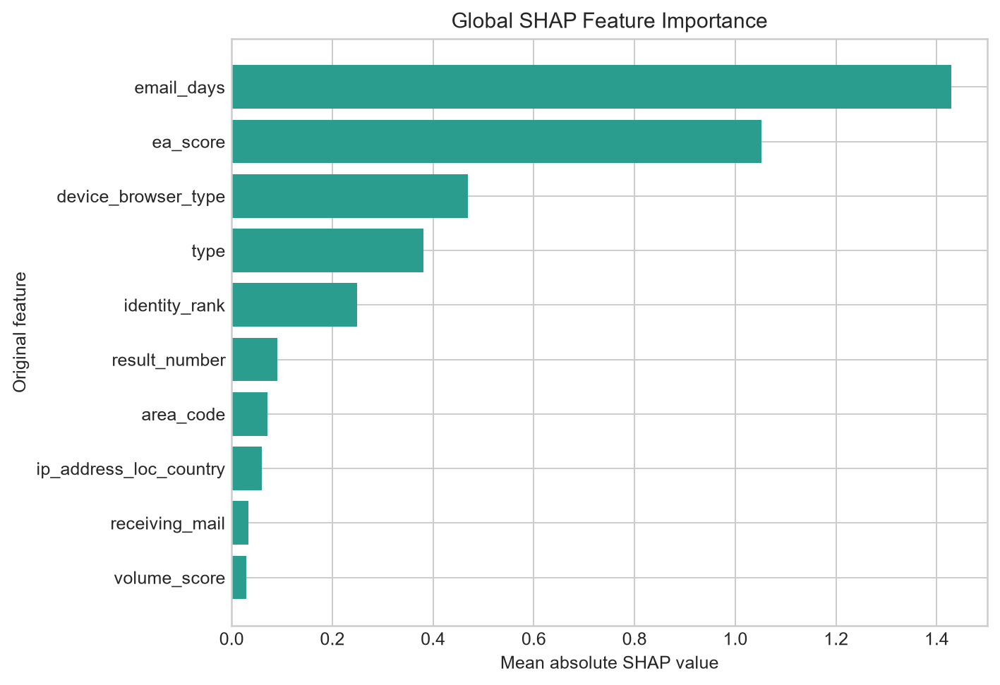
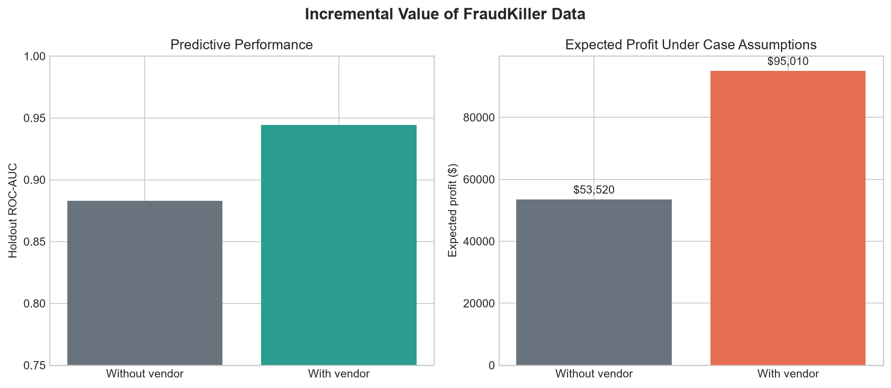

# Fraud Risk Analysis and Vendor Evaluation

A reproducible Python case study with two deliberately separate analyses: operational application monitoring and vendor-enriched fraud modeling.

## Project scope

### Task 1: operational monitoring

Task 1 uses `p1-dataset`, which contains payment applications from April through September 2019. Its `application_date` is a genuine operational time axis used for:

- application-volume trends;
- approval and fraud-rate trends;
- daily and product-level aggregation; and
- a specified anomaly-window comparison.

### Task 2: modeling and vendor evaluation

Task 2 uses `p2-dataset`, a selected sample of approximately 3,000 historical merchants with roughly half labeled as fraud and corresponding FraudKiller records. It is not treated as a naturally sampled chronological production stream.

Task 2 therefore uses a reproducible stratified train/validation/test benchmark. It compares XGBoost and CatBoost, converts fraud probabilities into business decisions, and estimates whether FraudKiller provides enough incremental value to justify its cost.

## Repository structure

```text
fraud_detection/
    applications.py             Task 1 cleaning and temporal aggregation
    common.py                   Shared normalization and validation helpers
    modeling.py                 Task 2 split, model paths, and evaluation
    feature_analysis.py         Train/Validation feature investigation
    tuning.py                   Train-only Optuna optimization and final confirmation
    profit.py                   Decision thresholds and expected-profit logic
    vendor.py                   Vendor-data cleaning and feature definitions
tests/                          Synthetic-data unit tests
docs/
    figures/                    Curated README visualizations
    results/                    Publishable result and split-audit tables
prepare_application_metrics.py  Generate Task 1 daily metrics
plot_application_anomalies.py   Plot a specified Task 1 anomaly window
clean_vendor_dataset.py         Normalize the vendor-enriched Task 2 data
compare_fraud_models.py         Run the stratified Task 2 benchmark
evaluate_vendor_profit.py       Evaluate with/without-vendor scenarios
investigate_features.py         Run audit, importance, and ablation experiments
tune_models.py                  Tune the frozen 14-feature classical benchmarks
generate_project_figures.py     Rebuild README figures and result tables
```

## Data

The original `FraudCaseStudy.xlsx` workbook is excluded from Git because application-level case-study data should not be published without explicit permission.

To reproduce the analysis, place the workbook in the repository root or pass its local path with `--input`. The expected worksheet names are `p1-dataset` and `p2-dataset`.

The business meaning of Task 2's `open_date` is not established by the case-study description. The primary benchmark does not use it for splitting and excludes raw `open_date`, `open_year`, `open_month`, and `open_day_of_week` from model inputs.

## Setup

```bash
python -m venv .venv
# Windows
.venv\Scripts\activate
# macOS/Linux
source .venv/bin/activate

python -m pip install -r requirements.txt
```

## Run the workflows

```bash
python prepare_application_metrics.py
python plot_application_anomalies.py \
  --anomaly-start 2019-06-25 \
  --anomaly-end 2019-07-04

python clean_vendor_dataset.py
python compare_fraud_models.py
python investigate_features.py --n-repeats 5
python tune_models.py --trials 40
python evaluate_vendor_profit.py \
  --approve-threshold 0.2 \
  --decline-threshold 0.8

python generate_project_figures.py
```

Intermediate files are written to the ignored `outputs/` directory. Curated figures and compact result tables are written to `docs/` and tracked by Git.

## Task 2 model paths

### XGBoost

- numerical median imputation;
- boolean most-frequent imputation;
- categorical most-frequent imputation and one-hot encoding with unknown-category handling; and
- conservative `XGBClassifier` defaults without aggressive tuning.

### CatBoost

- numerical median imputation;
- categorical most-frequent imputation;
- categorical columns preserved as named string features; and
- native CatBoost categorical handling with training verbosity disabled.

Preprocessing is fitted only on the training partition. Neither validation nor test values contribute to imputation or encoding statistics.

## Task 2 evaluation design

The selected vendor-evaluation sample is split with `random_state=42`, stratified on `is_fraud`:

- 70% training;
- 15% validation; and
- 15% final test.

Models are fitted on Train only. Validation PR-AUC is the primary comparison metric and supports later model-selection decisions. Both fitted models are then reported on the same untouched Test partition.

The benchmark also reports ROC-AUC, accuracy, balanced accuracy, precision, recall, and F1. Threshold-based metrics use a fixed probability threshold of 0.5. Positive-class prevalence is reported because it is the expected PR-AUC of a random ranking baseline.

### Split audit

| Split | N | Fraud | Non-Fraud | Fraud rate |
|---|---:|---:|---:|---:|
| Train | 1,942 | 939 | 1,003 | 48.35% |
| Validation | 416 | 201 | 215 | 48.32% |
| Test | 417 | 202 | 215 | 48.44% |

The machine-readable audit is available in [`docs/results/split_audit.csv`](docs/results/split_audit.csv).

## Results

### Task 1 application trends





The highlighted period is a specified case-study window, not an automatically detected anomaly or a causal estimate.

### Task 2 stratified model comparison

| Model | Validation PR-AUC | Validation ROC-AUC | Test PR-AUC | Test ROC-AUC | Test precision | Test recall | Test F1 |
|---|---:|---:|---:|---:|---:|---:|---:|
| XGBoost | **0.9630** | **0.9557** | 0.9459 | 0.9366 | **0.9185** | **0.8366** | **0.8756** |
| CatBoost | 0.9576 | 0.9501 | **0.9490** | **0.9405** | 0.9056 | 0.8069 | 0.8534 |



XGBoost is selected by validation PR-AUC. Test results are still reported for both models. Validation prevalence is 48.32% and test prevalence is 48.44%, providing the corresponding random-ranking PR-AUC baselines.

The exact machine-readable results are available in [`docs/results/model_comparison.csv`](docs/results/model_comparison.csv).

## Feature Investigation

All feature statistics, missingness rules, importance calculations, ablations, and reduced-set decisions use Train/Validation only. Test is accessed only after one final feature configuration has been selected. Importance describes predictive association with model output, not a causal effect on fraud.

### Availability and leakage audit

The primary feature matrix contains 14 allowed fields: five in-house and nine FraudKiller fields. `is_fraud` is the target and never enters `X`. Raw `open_date` plus `open_year`, `open_month`, and `open_day_of_week` remain excluded. `result_number` is an allowed numeric vendor feature: the FraudKiller data dictionary defines it as the number of results returned for the record. It is a count, not an identifier, so it is not flagged as ID-like. The data dictionary does not establish why the count may be associated with fraud, and no causal interpretation is claimed.

The complete machine-readable outputs include:

- [`feature_audit.csv`](docs/results/feature_audit.csv)
- [`feature_availability.csv`](docs/results/feature_availability.csv)
- [`missingness_analysis.csv`](docs/results/missingness_analysis.csv)
- [`permutation_importance.csv`](docs/results/permutation_importance.csv)
- [`shap_feature_importance.csv`](docs/results/shap_feature_importance.csv)
- [`feature_group_ablation.csv`](docs/results/feature_group_ablation.csv)
- [`vendor_feature_ablation.csv`](docs/results/vendor_feature_ablation.csv)
- [`missing_indicator_comparison.csv`](docs/results/missing_indicator_comparison.csv)
- [`reduced_feature_comparison.csv`](docs/results/reduced_feature_comparison.csv)
- [`final_feature_confirmation.csv`](docs/results/final_feature_confirmation.csv)

### Missingness findings

Train-only missingness is strongly associated with the observed label for several fields:

| Feature | Missing rate | Fraud rate missing | Fraud rate present | Difference |
|---|---:|---:|---:|---:|
| `ea_score` | 21.01% | 95.34% | 35.85% | +59.49 pp |
| `identity_rank` | 2.27% | 97.73% | 47.21% | +50.52 pp |
| `is_connected` | 17.40% | 84.32% | 40.77% | +43.55 pp |

Missing indicators are tested only when Train missingness is between 1% and 95%. Adding six indicators reduced XGBoost Validation PR-AUC from 0.9630 to 0.9617 and increased CatBoost from 0.9576 to 0.9615. Adding the interpretable `vendor_missing_count` produced 0.9621 and 0.9614 respectively. The engineered variants were therefore not selected over the simpler reduced configuration.

### Permutation importance and SHAP

Validation PR-AUC permutation importance and native TreeSHAP agree on the dominant fields:

| Model | Leading permutation features | Leading SHAP features |
|---|---|---|
| XGBoost | `email_days`, `ea_score`, `type`, `device_browser_type`, `identity_rank` | `email_days`, `ea_score`, `device_browser_type`, `identity_rank`, `type` |
| CatBoost | `email_days`, `ea_score`, `type`, `device_browser_type`, `identity_rank` | `email_days`, `ea_score`, `device_browser_type`, `type`, `identity_rank` |



These fields contributed strongly to model predictions; the analysis does not establish that they cause fraud.

### Vendor contribution

| Feature set | XGBoost Validation PR-AUC | CatBoost Validation PR-AUC |
|---|---:|---:|
| In-house only | 0.8881 | 0.8954 |
| Vendor only | 0.9420 | 0.9354 |
| In-house + vendor | **0.9630** | **0.9576** |

The controlled leave-one-vendor-feature-out experiment identifies `email_days` as the dominant incremental vendor field: removing it lowered Validation PR-AUC by 0.0662 for XGBoost and 0.0610 for CatBoost. Other individual vendor removals had much smaller effects in this sample.

### Reduced feature set

The ranking is derived from Validation permutation importance averaged across both models. The selection rule chooses the smallest configuration within 0.002 mean Validation PR-AUC of the best candidate. It selected:

```text
ea_score, identity_rank, email_days, device_browser_type, type
```

| Model | Configuration | Validation PR-AUC | Test PR-AUC | Test ROC-AUC |
|---|---|---:|---:|---:|
| XGBoost | Original 14 | 0.9630 | 0.9459 | 0.9366 |
| XGBoost | Final 5 | **0.9636** | **0.9461** | 0.9362 |
| CatBoost | Original 14 | 0.9576 | **0.9490** | **0.9405** |
| CatBoost | Final 5 | **0.9641** | 0.9458 | 0.9368 |

The final five-feature configuration was chosen before these Test results were calculated. It materially reduces complexity while retaining similar performance; Test numbers are confirmation, not selection criteria.

## Hyperparameter Optimization

The classical tuning phase uses Optuna's seeded TPE Bayesian optimizer for XGBoost and CatBoost. It always uses the full 14-feature primary benchmark; the five-feature compact model above remains a separate, unchanged ablation.

Each Optuna trial is evaluated only within the existing Train partition using five-fold `StratifiedKFold` with `shuffle=True` and `random_state=42`. Mean cross-validation PR-AUC is maximized and its fold standard deviation is recorded. The fixed Validation partition is not reused by individual trials: it is accessed once after each search to compare the repository default with the best tuned candidate and freeze one configuration per model. Only after both decisions are frozen are Train and Validation combined for a single final Test evaluation.

The default run uses 40 trials per model and a seeded `TPESampler(seed=42)`:

```bash
python tune_models.py --trials 40
# Optional independent budgets
python tune_models.py --xgb-trials 40 --catboost-trials 40
```

The run writes:

- [`hyperparameter_trials.csv`](docs/results/hyperparameter_trials.csv), with candidate parameters and Train-CV PR-AUC;
- [`tuned_model_comparison.csv`](docs/results/tuned_model_comparison.csv), with default/tuned CV and Validation metrics;
- [`best_hyperparameters.json`](docs/results/best_hyperparameters.json), with the frozen choices, seeds, and trial counts;
- [`final_tuned_test_comparison.csv`](docs/results/final_tuned_test_comparison.csv), containing the one-time Test confirmation.

Validation PR-AUC changes below 0.001 are described as negligible, changes below 0.005 as marginal, and larger gains as meaningful. Negative changes retain the default configuration.

### Optimization results

The completed run used 40 trials per model. Both searches completed all 40 trials, and both tuned candidates produced marginal Validation PR-AUC improvements. The tuned configuration was therefore frozen for each model before Test was accessed.

| Model | Configuration | Train-CV PR-AUC | Validation PR-AUC | Validation ROC-AUC | Validation delta | Frozen |
|---|---|---:|---:|---:|---:|---|
| XGBoost | Default | 0.9501 | 0.9630 | 0.9557 | N/A | No |
| XGBoost | Tuned | **0.9532** | **0.9670** | **0.9608** | +0.0040 (marginal) | **Yes** |
| CatBoost | Default | 0.9457 | 0.9576 | 0.9501 | N/A | No |
| CatBoost | Tuned | **0.9510** | **0.9623** | **0.9532** | +0.0047 (marginal) | **Yes** |

After freezing both choices, each tuned model was refitted once on Train+Validation and evaluated on the untouched Test partition:

| Model | Frozen configuration | Validation PR-AUC | Test PR-AUC | Test ROC-AUC | Test precision | Test recall | Test F1 |
|---|---|---:|---:|---:|---:|---:|---:|
| XGBoost | Tuned | 0.9670 | 0.9483 | 0.9382 | 0.9176 | 0.8267 | 0.8698 |
| CatBoost | Tuned | 0.9623 | **0.9524** | **0.9457** | **0.9185** | **0.8366** | **0.8756** |

XGBoost optimization took approximately 62 seconds; its final Train+Validation fit took 0.36 seconds and Test inference took 0.015 seconds. CatBoost optimization took approximately 6,381 seconds (106.4 minutes); its final fit took 42.28 seconds and Test inference took 0.010 seconds. These are approximate single-run wall-clock measurements from the local environment.

### FraudKiller vendor evaluation



| Scenario | Holdout ROC-AUC | Holdout PR-AUC | Expected profit |
|---|---:|---:|---:|
| Without FraudKiller data | 0.8829 | 0.8520 | $53,520.00 |
| With FraudKiller data | 0.9443 | 0.9506 | $95,010.50 |

The vendor comparison preserves the case-study assumptions: $40 monthly revenue per approved merchant for 12 months, $500 fraud loss, $50 manual-review cost, $0.50 vendor call cost, and a 30% manual-review approval rate. Scenario outputs are not production forecasts.

## Testing

```bash
python -m unittest discover -s tests -v
```

Tests use synthetic data and cover Task 1 temporal aggregation, Task 2 stratification and split auditing, excluded features, leakage-safe preprocessing, missing indicators, feature audits, original-level permutation importance, validation-only ablation, active model families, probability outputs, business thresholds, and profit calculations. GitHub Actions runs the same command for each push and pull request.

## Future work

Tabular foundation models and date-feature ablations may be evaluated in later iterations. They are not implemented in the current primary benchmark.
